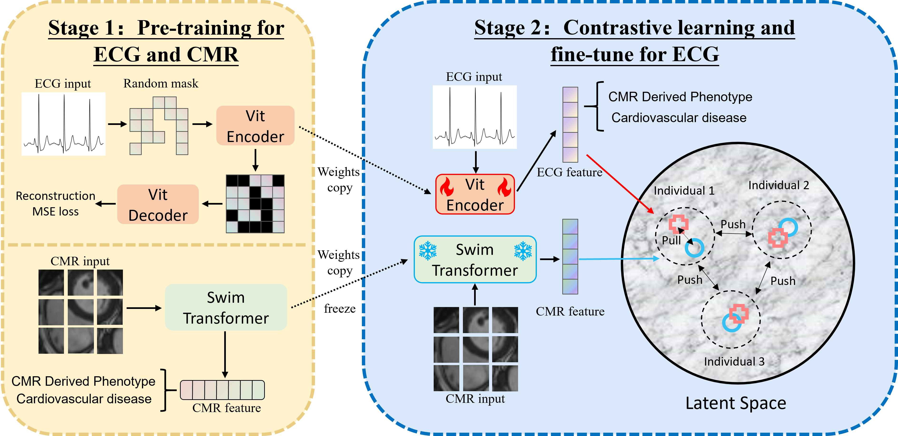

# ECCL
This is the official implementation of our MICCAI 2024 paper Cross-Modality Cardiac Insight Transfer: A Contrastive Learning Approach to Enrich ECG with CMR Features.

## Abstract
Cardiovascular diseases are the leading cause of death worldwide, and accurate diagnostic tools are crucial for their early detection and treatment. Electrocardiograms (ECG) offer a non-invasive and widely accessible diagnostic method that, despite its convenience, is limited in providing in-depth cardiovascular information. On the other hand, Cardiac Magnetic Resonance Imaging (CMR) can reveal detailed structural and functional heart information, yet it is high in cost and not widely accessible. This study aims to bridge this gap through a contrastive learning framework that deeply integrates ECG data with insights from CMR, allowing the extraction of cardiovascular information from ECG alone. We developed an innovative contrastive learning algorithm trained on a large-scale paired ECG and CMR dataset, enabling ECG data to map onto the feature space of CMR data. Experimental results demonstrate that our method significantly improves the accuracy of cardiovascular disease diagnosis using only ECG data. Furthermore, our approach enhances the correlation coefficient for predicting cardiac traits from ECG, revealing the potential connections between ECG and CMR. This study not only proves the effectiveness of contrastive learning in cross-modal medical image analysis but also offers a low-cost, efficient way to leverage existing ECG equipment for a deeper understanding of cardiovascular health conditions.
## Environment Set Up
Install required packages:
```bash
conda create -n ECCL python=3.9
conda activate ECCL
pip install -r requirements.txt
```
## Citation
If you find our paper/code useful, please consider citing our work:
```
@inproceedings{ding2024cross,
  title={Cross-Modality Cardiac Insight Transfer: A Contrastive Learning Approach to Enrich ECG with CMR Features},
  author={Ding, Zhengyao and Hu, Yujian and Li, Ziyu and Zhang, Hongkun and Wu, Fei and Xiang, Yilang and Li, Tian and Liu, Ziyi and Chu, Xuesen and Huang, Zhengxing},
  booktitle={International Conference on Medical Image Computing and Computer-Assisted Intervention},
  pages={109--119},
  year={2024},
  organization={Springer}
}
```
